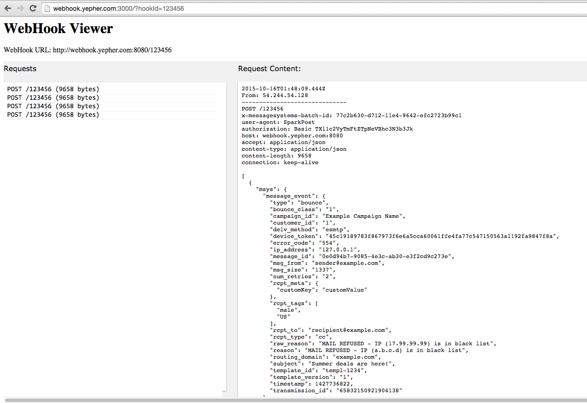
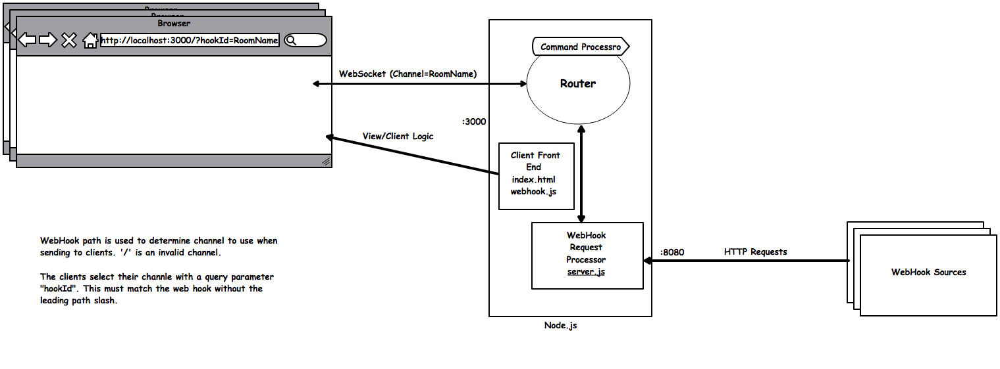
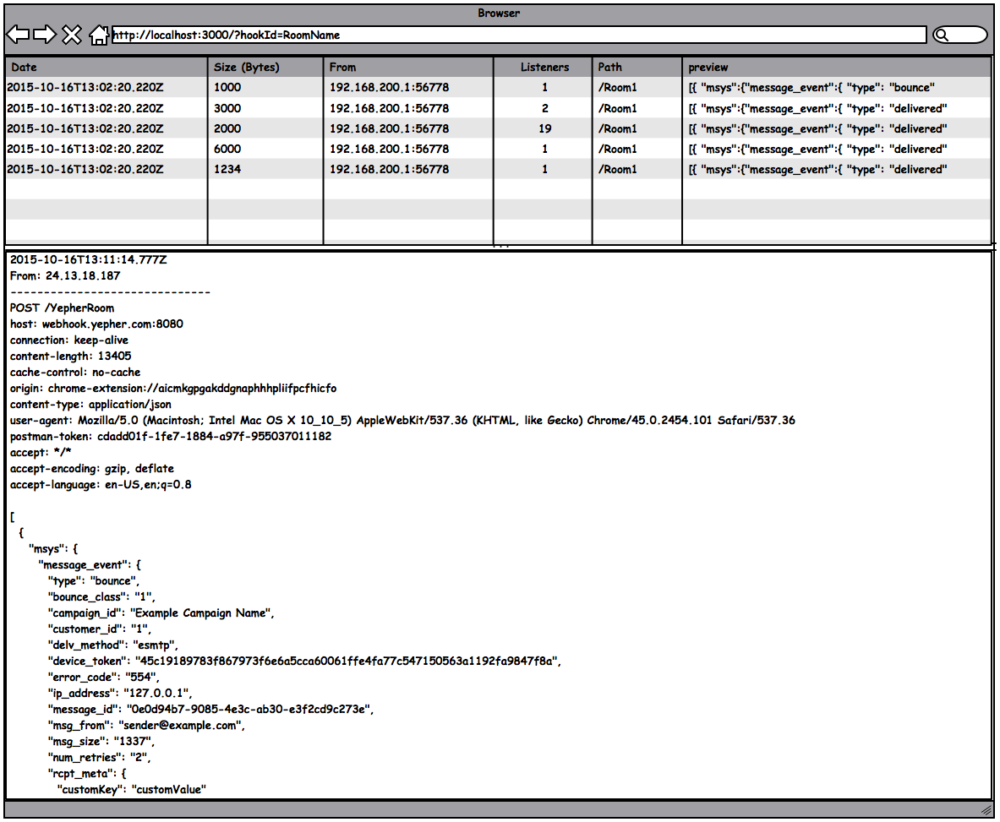

# WebHook Monitor

Webhook Monitor enables you to easily view HTTP requests in your own local browser. There is no need to open a port in order receive and view HTTP content from the. Multiple users can view the HTPP request concurrently and from any location.

If you are implementing an App that uses a RESTful API you can point your client at Webhook Monitor to see the headers and body of your requests.

If you are developer a consumer of Webhook Events you can point your Webhook generator at Webhook Monitor to see what the details of those events.

**Webhook Monitor:**
* Does not store the data on the server
* Allows multiple users to view HTTP requests concurrently

## Similar Tools:

| Name  | Site  | Description  |
|---|---|---|
| Webhook.site  | [link](http://webhook.site/)  | Webhook Tester allows you to easily test webhooks and other types of HTTP requests.  |

## Example Usage

* WebHook Server: http://[SERVER]:8080/YouName
* Webhook Viewer: http://[SERVER]:3000/?hookId=YouName

## Getting started

* Fetch Source
	* `git clone https://github.com/yepher/webhook_monitor.git`
* Run Server
	* `cd webhook_monitor/src`
	* `npm install`
	* `node server.js`

	

## Signaling Design

## UI Design

